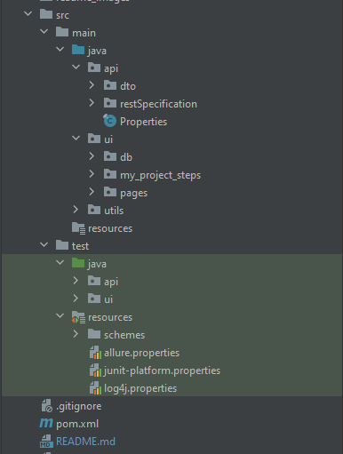
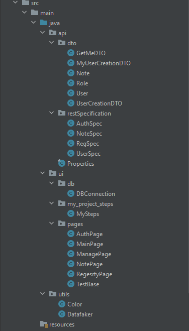
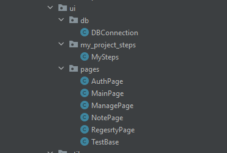
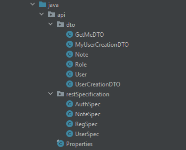
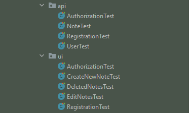
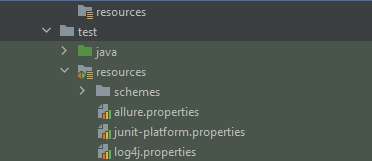

# **Notes**

**Проект "Notes** представляет собой комплексное решение для автоматизации тестирования API и UI с использованием технологий Selenium, RestAssured, JUnit 5 и языка программирования Java. Проект разработан с учетом лучших практик автоматизации тестирования и предоставляет подробные отчеты с использованием Allure, включая скриншоты к каждому тесту.

### **Требования**

Java 11 

Maven 

Зависимости 

Selenium WebDriver 

RestAssured 

JUnit 5 

Allure

## **Установка и настройка**

#### **Клонировать репозиторий:**

git clone https://github.com/BaevaEV/Notes.git

## **Общая структура проекта**

**src/main/java/api: Исходный код приложения api и ui тестов**

-----------

### **UI**

src/main/java/ui/db: Подключение к базе данных и методы для работы с запросами

src/main/java/ui/MySteps: объемные и часто используемые шаги тестов вынесены в отдельный пакет

src/main/java/ui/Pages: классы с использованием паттернов Page Object, Page Factory

src/main/java/ui/utils: классы выполняющие общие вспомогательные функции

Color.class - получение списка цветов при редактировании/создании заметки 

Datafaker.class - генерация тестовых данных

-----------

### **API**

src/main/java/api/dto: DTO объекты

src/main/java/api/restSpecifications: Спеки используемые в тестах для оптимизации кода

Properties.class - тестовые данные (urls и paths)

----------

src/test/java/api: Тесты API с использованием RestAssured

src/test/java/ui: Тесты UI с использованием Selenium

----------

src/test/resources: Ресурсы для тестов (конфигурационные файлы)

allure.proptrties - настройки формирования allure report

junit-platform.properties - настройка паралельного запуска автотестов

log4j.properties - настрйоки уровней логирования

---------

### **Запуск тестов**

Тесты могут быть запущены из командной строки с использованием Maven:

mvn clean test

### **Генерация отчетов с Allure**

Для генерации отчетов с использованием Allure выполните следующую команду после завершения тестов:

mvn allure:serve

Отчет будет доступен по адресу target/site/allure-maven/index.html.

**Отчеты Allure**
После запуска тестов с Allure, отчеты будут доступны в директории target/site/allure-maven/index.html. В отчетах будут представлены скриншоты к каждому тесту для более детального анализа результатов.

### **Тесты**

#### **UI**

**Регистрация нового пользователя:**

Успешная регистрация нового пользователя

**Авторизация пользователя:**

Авторизация нового пользователя

Авторизация существующего пользователя

**Создание заметки:**

Создание новой заметки

Создание заметок с разными цветами

**Редактирование созданных заметок:**

Редактирование созданных заметок

**Удаление созданных заметок:**

Удаление созданных заметок

#### **API**

**Авторизация существующего пользователя:**

Авторизация существующего пользователя

Авторизация несуществующего пользователя

Авторизация только с логином

**Проверка регистрации:**

Проверка регистрации только с обязательными полями

Проверка регистрации со всеми полями

Проверка регистрации только со всеми полями

**Создание и удаление заметок**

