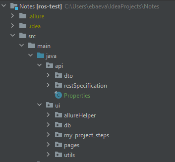
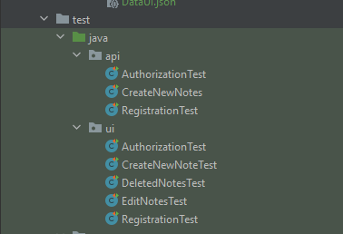
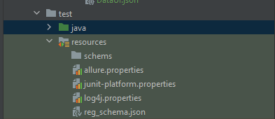

Notes

Описание проекта
Проект "AwesomeTestProject" представляет собой комплексное решение для автоматизации тестирования API и UI с использованием технологий Selenium, RestAssured, JUnit 5 и языка программирования Java. Проект разработан с учетом лучших практик автоматизации тестирования и предоставляет подробные отчеты с использованием Allure, включая скриншоты к каждому тесту.

Требования
Java 11
Maven
Зависимости
Selenium WebDriver
RestAssured
JUnit 5
Allure
Установка и настройка
Клонировать репозиторий:

bash
Copy code
git clone https://github.com/BaevaEV/Notes.git

Запустить тесты:

bash
Copy code
mvn test

Структура проекта

src/main/java/api: Исходный код приложения api тестов
src/main/java/ui: Исходный код приложения ui тестов

src/test/java/api: Тесты API
src/test/java/ui: Тесты UI

src/test/resources: Ресурсы для тестов (конфигурационные файлы)

Запуск тестов
Тесты могут быть запущены из командной строки с использованием Maven:

bash
Copy code
mvn clean test

Генерация отчетов с Allure
Для генерации отчетов с использованием Allure выполните следующую команду после завершения тестов:

bash
Copy code
mvn allure:serve
Отчет будет доступен по адресу target/site/allure-maven/index.html.

Структура тестов
Тесты разделены на пакеты:

api: Тесты для API с использованием RestAssured
ui: Тесты для UI с использованием Selenium

Отчеты Allure
После запуска тестов с Allure, отчеты будут доступны в директории target/site/allure-maven/index.html. В отчетах будут представлены скриншоты к каждому тесту для более детального анализа результатов.

